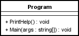
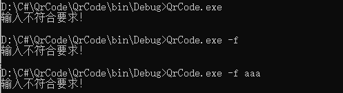
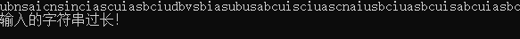
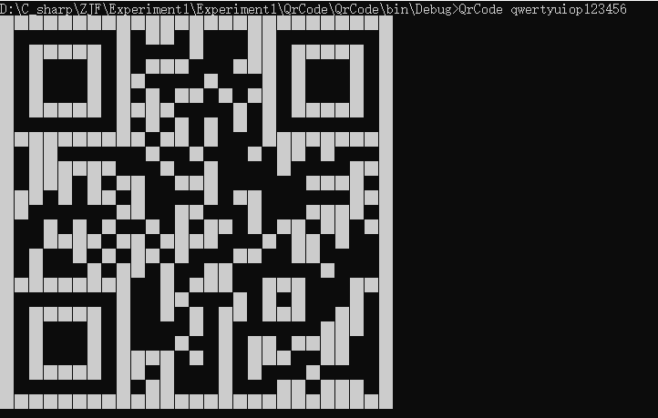
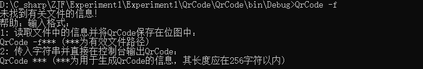
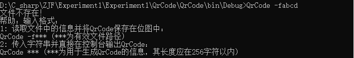
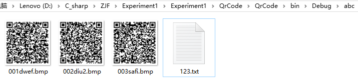
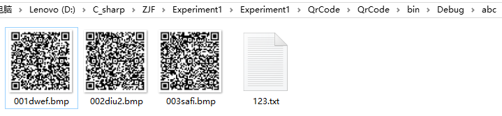

#《C#控制台编程》实验报告
学院：软件学院    班级：4班    学号：3017218178    姓名：张剑锋
日期：2019年3月14日
## 一、功能概述   
1) 当用户在命令行输入参数时，判断参数是否是QrCode可以生成的信息，当符合要求时就直接在控制台产生QrCode的结果   
2) 当用户在命令行输入参数且参数以-f开头时，从-f后面的信息取得文件路径，根据文件中的信息生成带QrCode信息的bmp位图   
3) 限制输入的待处理的字符串长度在256个字符以内   
## 二、项目特色   
1) 既实现了控制台输入，又实现了文件输入；   
2) 既能在控制台输出，也可将信息存储在有QrCode的位图文件中；   
3) 对由输入造成的各种可能的异常都基本做到了较好的处理；   
## 三、代码总量   
96行   
## 四、工作时间   
2小时
## 五、知识点总结图   
 
## 六、结论
#### 1.1项目名称：
QrCode控制台输出
#### 1.2操作步骤：
在控制台中运行程序，程序后跟一个需要被处理为QrCode的字符串参数。
#### 1.3实际结果描述、结论：
当未输入参数时，提示帮助信息，并正常终止程序。
     
当输入的字符串参数的长度超过规定的长度时，提示帮助信息，并正常终止程序。
     
当输入的字符串满足条件时，直接在控制台示QrCode码。
     
#### 2.1项目名称：
 QrCode从文件中读取字符串并生成带有QrCode信息的位图文件   
#### 2.2操作步骤：
在控制台中运行程序时，以-f***(-f+文件名)的形式传入参数。   
#### 2.3实际结果描述、结论：
 当参数-f后未跟任何有关文件的信息时，提示帮助信息，并正常终止。   
     
当参数-f后的文件无效时，提示帮助信息，并正常终止。   
     
当参数-f后的文件有效时   
     
     
当再次执行正确命令，本次执行能够正确覆盖原有图片。   
     
     

