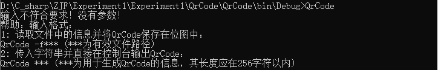

# Experiment1
## 功能概述:  
a. 当用户在命令行输入参数时，参数不为-f用参数中的字符串生成QrCode并在控制台中打印  
b. 当用户在命令行输入参数且参数为-f时，从-f后面的参数中读取文件路径，根据文件中的信息生成有二维码的bmp位图  
c. 限制输入的待处理的字符串长度在2048个字符以内
## 项目特色：  
从控制台传入参数，既能根据参数在控制台中直接生成QrCode，也能从文件中读取并将QrCode生成为位图文件
## 代码总量：  
79行
## 工作时间：  
2小时
## 结论：  
### 1. 当输入的参数无效时：  
a) 当无参数时  
b)当参数为-f但-f后未跟参数时  
c)当-f后参数所指定文件不存在时  

### 2. 当参数为一串字符串且字符串长度超过2000个字符时：  

### 3. 当参数为一串需要处理为QrCode的字符串时：  
如字符串：qwertyuiop1234567890   

### 4. 当参数为-f且-f后参数为一个有效文件的路径时：  
  
如：-f 123.txt:  
  
如：-f abc/123.txt:  
  
